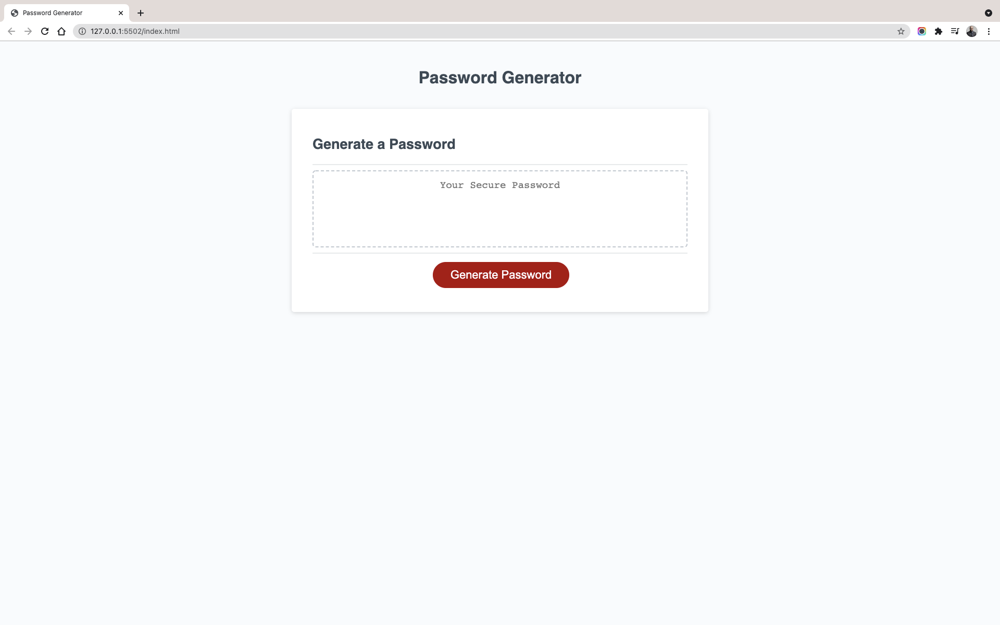

# Password-Generator
This is a prototype for passowrd generator using vanila Javascript that enables employees to generate random passwords based on criteria that they’ve selected.

## Table of Contents
* [Installation](#installation)
* [User Stroy](#UsersStory)
* [Screen-Shots](#Screen-Shots)

## Reasons for this Project
To modify starter code to create an application that enables employees to generate random passwords based on criteria that they’ve selected.

## User Story

```
AS AN employee with access to sensitive data
I WANT to randomly generate a password that meets certain criteria
SO THAT I can create a strong password that provides greater security
```
### Link
[Passowrd-Generator](https://mohamedmesahel.github.io/Password-Generator/)


